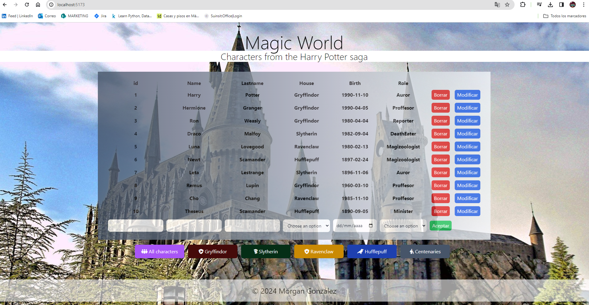
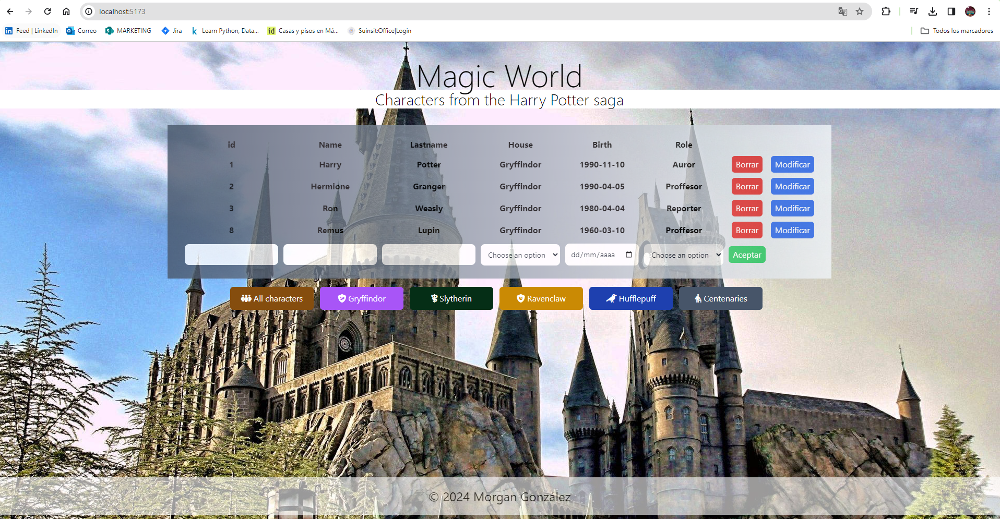
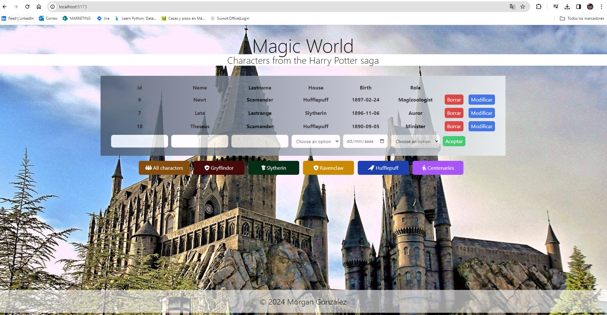

# Proyecto Final Certificacion

# Título Magic World
# Subtítulo Characters from the Harry Potter saga

# Descripción Es una base de datos de personajes de la saga de Harry Potter, en la que se muestra un id, nombre, apellidos, casa a la que pertenecen, fecha de nacimiento y su profesión. A través de los botones se obtienen los personajes según sus casas: Gryffindor, Slytherin, Hufflepuff y Ravenclaw y, un botón para obtener los personajes de más de 100 años. Cuando se añade un personaje, no permitirá hacerlo con un 'id' que ya exista.

# MongoDB, Python, FASTApi y Qwik

# Todos los personajes  

# Personajes de Gryffindor 

# Personajes de más de 100 años 

# Enlace a YOUTUBE: https://youtu.be/OuVzKKdIBag 